# Item Pipes
Item Pipes is a mod that provides item transportation and item sorting.

**Current Version = 0.1.1 (Beta)**  
For testing purposes, the mod only works on the farm for now. 

## WARNING:
This mod is in beta version. Backup your saves or create a new save before playing with it. You might lose items and get crashes.

## Contents:
- [Current Features for 0.1.1](#current-features-for-011)
	- [Pipes](#pipes)
		- [Connectors](#connectors)
		- [Outputs](#outputs)
		- [Inputs](#inputs)
	-  [Supported containers](#supported-containers)
	-  [Supported buildings](#supported-buildings)
	-  [Network Building](#network-building)
	-  [Pipe Signaling](#pipe-signaling)
	-  [Pipe Priorities](#pipe-priorities)
-  [Planned Features](#planned-features)
-  [See also](#see-also)

---

## Current Features (for 0.1.1):

## Pipes:
- ### Connectors:
	- **Connector Pipe**  
Connector Pipes act as the link between Output and Input pipes.  
They moves items at 2 tiles/1 second  
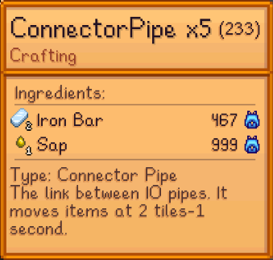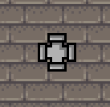  
 

## IOPipes:
- ### Outputs:
	- **Extractor Pipe**  
Extractor Pipes extract items from an adjacent container, at 1 stack/2 seconds.  
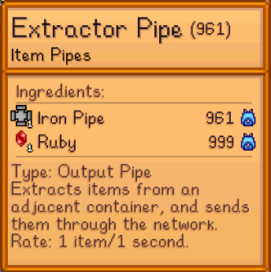   
- ### Inputs:
	- **Inserter Pipe**  
Inserter Pipes insert items into an adjacent container. They do not filter any item.  
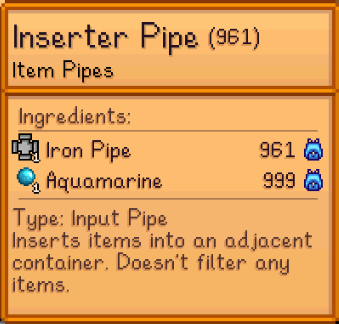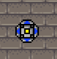  
	- **Polymorphic Pipe**  
Polymorphic Pipes insert items into an adjacent container. They filter items based on the container's current items. If the container is empty, They act like an Inserter Pipe, until 1 item enters the container.  
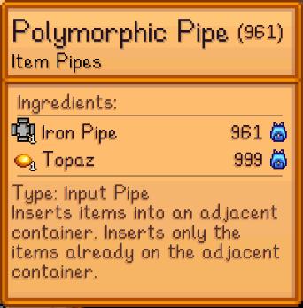  
	- **Filter Pipe**  
Filter Pipes insert items into an adjacent container. They filter items based on the pipe's internal inventory. To open the inventory, simply left click the Filter Pipe like you would with a chest. Then add the items you want filtered. If the internal inventory is empty, they act like an Inserter Pipe, until alteast 1 item is added to the internal inventory.  
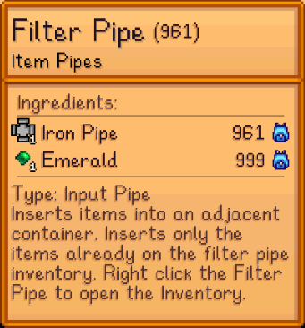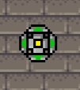  

- ### Supported containers:  
	- **Chest**  
Regular vanilla chests. As you can see below, the items get out of a chest, and enter the other.
  
  
	- **Junimo Chest**  
Junimo chests work as chests. But as their inventory is linked, you can move items wirelessly.  
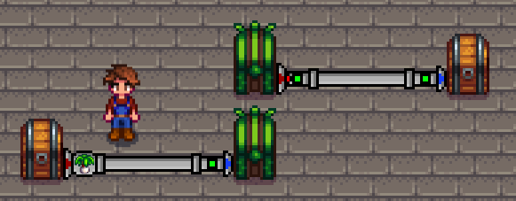  
	- **Fridge**  
	Not yet implemented.  
	- **Mini-Shipping Bin**  
Mini-Shipping Bins work the exact same as chests.  

- ### Supported buildings:
	- **Shipping Bin**  
The Shipping Bin doesn't work like a regular chest, but you can insert items into it if an input is adjacent. These items will be shipped at the end of the day. 
Be careful, as you may not be able to get the items back once the get piped in.  Also, as the Shipping Bin has 2 tiles, you can connect 2 inputs to it.
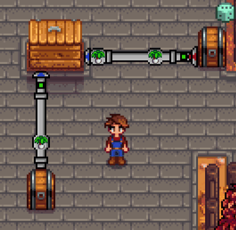  

---

## Network Building:
A valid network has to have **at least 1 Output Pipe and 1 Input Pipe**.  
Also for the output to start pumping items, the input has to have a valid adjacent container.  
That said, you can have as many outputs and inputs as you like.  
This is the shortest posibble network, from that, you can extend it as you like.  
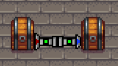  

---

- ### Pipe Signaling: 
- Pipe states are shown by pipe signaling. Each IOPipe can have 3 colors, each corresponding with a state:
	- **Red/Off**:  
	The pipe is locked and wont send/receive items. You can manually turn on or off pipes by clicking them.  
	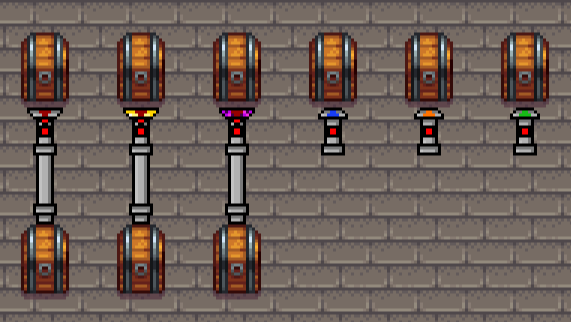 
	- **Green/On**:  
	The pipe is enabled and will send/receive items if possible.  
	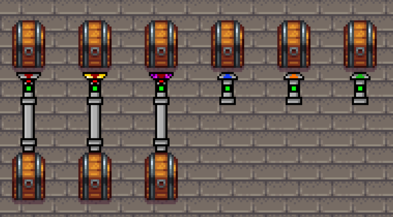
	- **Orange/Disconnected**:  
	The pipe isn't connected to an adjacent container. Since a container can only have 1 adjacent pipe of each pipe type, you will have to remove all adjacent pipes to the container, and then place the new one. (This will most likely change moving forward).  
	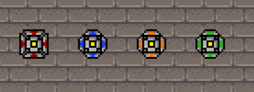
Here, the pipes aren't connected to any container, so they stay orange.  
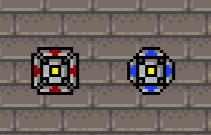  
Then, when a container is added, they turn green.  
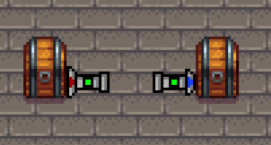  
Finally, there are 2 options. If you place a pipe of the same type, it won't connect to the container. But you can actually place a different pipe type, and it will connect.  
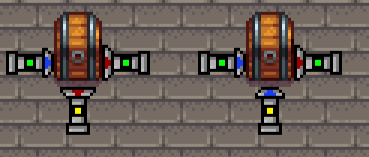  

---

## Pipe Priorities:
Items get send to Input pipes based on their priority. The Output pipe will try send items to the highest priority Inputs first.

| Priority  | Input Type |
| ------------- | ------------- |
| 3  | Filter Pipe  |
| 2  | Polymorphic Pipe  |
| 1  | Inserter Pipe  |

Sorting example:
  

---

## Planned Features (For 1.0.0 release):
- Custom Filter Chest UI
- Add whitelist and blacklist to Filter Chest?
- Add ghosts items in filter
- Add thread stopping when unloading save
- Add config file with debug mode
- Pipe tiers

## Planned Features:
**Short term:**
- Add machine that if connected to a network, it will turn that network pipes crossable
- Add IOPipe state message, so to not rely only on colors.
- Add a way to switch on/off outputs
- Add more pipe feedback (like when a network is correctly build)
- Add Extractor Filter Pipe?

**Long Term:**
- Storage Hub: A central storage chest. Like in AE from minecraft.
- Pipes working between locations.

## See also
- [Release Notes](https://github.com/sergiomadd/StardewValleyMods/edit/main/ItemPipes/docs/release-notes.md)
- [Nexus Mod Page]
